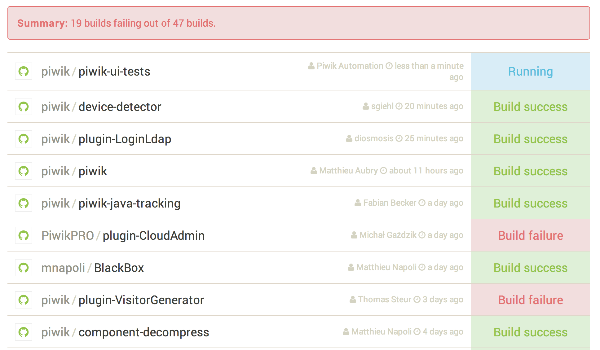

# CI Status dashboard

The CI Status dashboard is a web application that shows a build status summary for all your repositories.

It will fetch the continuous integration status for repositories on [Travis-CI.org](https://travis-ci.org/) or [Travis-CI.com](https://travis-ci.com/).

[](https://ci-status.com/)

## Installation

### Requirements

CI Status requires PHP 5.5 or higher. To use CI Status you need a GitHub account and a Travis-CI account.

### Create a Github application for OAuth authentication

You need to [create a GitHub application](https://github.com/settings/applications/new) so that you can have an Client ID and Client secret to integrate with GitHub's API.

This is necessary to allow users to login into *CI Status* with their GitHub account.

### Production setup

These commands will setup the application and ask you for the application Client ID and Client secret:

```
$ composer install --no-dev --optimize-autoloader --prefer-source
$ app/console cache:clear --env=prod --no-debug
```

To improve security and privacy, be aware that users GitHub tokens are stored in the sessions. You need to take care of how those sessions are stored on your server to protect those tokens. It is recommended that you set up a short expiration time and ensure that the session files are correctly garbage-collected.

### Local setup

CI Status is a standard Symfony application:

```
$ composer install
$ app/console server:run
```

Note: on Ubuntu you may need to run `sudo apt-get install php5-intl`.

## Configuration

You can set the following options in `app/config/parameters.yml`:

```yaml
parameters:
    # ...

    # Exclude specific repositories from the dashboard
    excluded_repositories:
        - piwik/piwik-tests-plugins
        - piwik/piwik-python-api
```

## Credits

Built by [Piwik](http://piwik.org/) and released under the [GNU Affero GPL license v3](LICENSE).

Pull requests are welcome!
